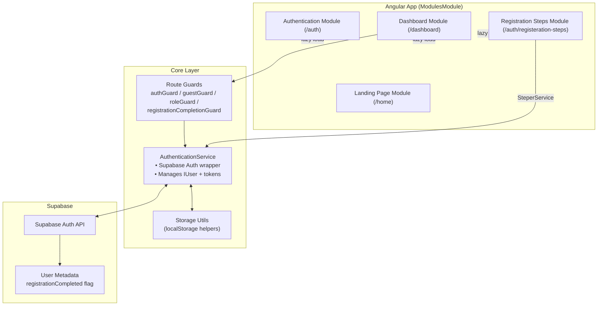

# Mentorship Frontend — System Diagram

## Flow Details

1. **Routing & Modules**
   - `app-routing.module.ts` bootstraps `ModulesModule`, which redirects to `/auth`, `/home`, or `/dashboard`.
   - Each feature module has its own routing file for lazy loading.

2. **Authentication**
   - `AuthenticationService` wraps Supabase SDK calls, stores `IUser` plus tokens, and exposes status via `BehaviorSubject`s.
   - `authGuard` protects authenticated areas; `guestGuard` keeps logged-in users out of auth forms.
   - `roleGuard` variants enforce mentor/mentee/admin routes.

3. **Registration Steps**
   - `SteperService` lives in `modules/registration-steps/services`.
   - Shared four steps for both roles; mentors automatically get the fifth “Preference” step.
   - Completing the wizard calls `AuthenticationService.markRegistrationComplete()`, updating Supabase metadata and redirecting to `dashboard/discover`.

4. **Dashboard Access**
   - `DashboardRoutingModule` applies `authGuard` + `registrationCompletionGuard`, ensuring mentors finish onboarding before accessing main pages.

5. **Storage & Tokens**
   - User snapshots + access tokens are persisted via `StorageKeys.USER_DATA`/`TOKEN`.
   - Supabase handles refresh; local data stays current via `initializeAuth()` and auth state listeners.

Use this diagram as the high-level map; dive into the corresponding files for implementation specifics.

